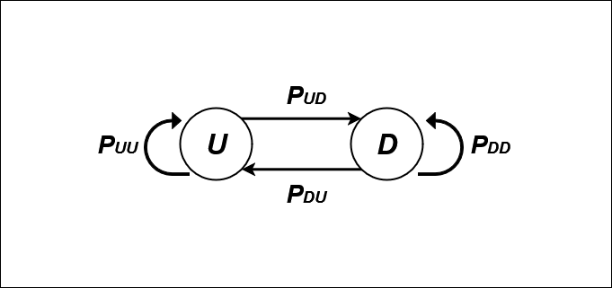

# Using Markov Chain to Analyze a Forex Pair

Using the theory from the first part [here](https://github.com/handiko/Markov-Chain-In-Financial-Market), we are now trying to analyze a forex pair to have a better understanding, or at least a first glimpse of its behavior.
The goal here is to have an initial insight that we could then use to develop a trading strategy.

## Previous Up/Down Day and Its Relation to the Next Day's State
This chapter's goal is simple: **What is the transition matrix of a previous up/down day to the next day's state?** Either it more probable to be an up day or a down day?
Let's say the up day is **U** and the down day is **D**. The full list of transitions that could happen is as follows:

$U \to U$

$U \to D$

$D \to U$

$D \to D$

There are $N^{M}$ possible transitions for $N$-states that precede it and $M$-states that follow. Since $N = 2$, for either $U$ or $D$, and $M = 2$, for either $U$ or $D$ as well, 4 transitions could occur for a 1-previous up-or-down day related to the next day's state.

* $P_{U \to U}$: The probability of an Up day being followed by an Up day.
* $P_{U \to D}$: The probability of an Up day being followed by a Down day.
* $P_{D \to U}$: The probability of a Down day being followed by an Up day.
* $P_{D \to D}$: The probability of a Down day being followed by a Down day.

The transition matrix for this chain is:

$$
P = 
\begin{pmatrix}
p_{\text{UU}} & p_{\text{UD}} \\
p_{\text{DU}} & p_{\text{DD}} 
\end{pmatrix}
$$

Since the following day must be either an Up or a Down day, then the probabilities of transitioning from a specific state must sum to 1.

* $P_{U \to U} + P_{U \to D} = 1$
* $P_{D \to U} + P_{D \to D} = 1$
