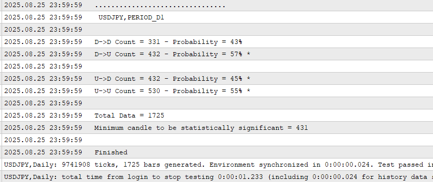
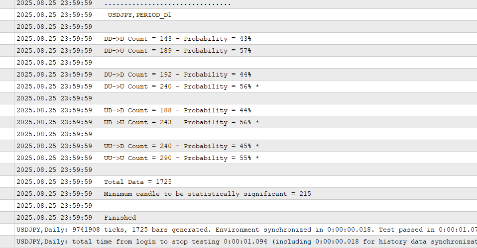
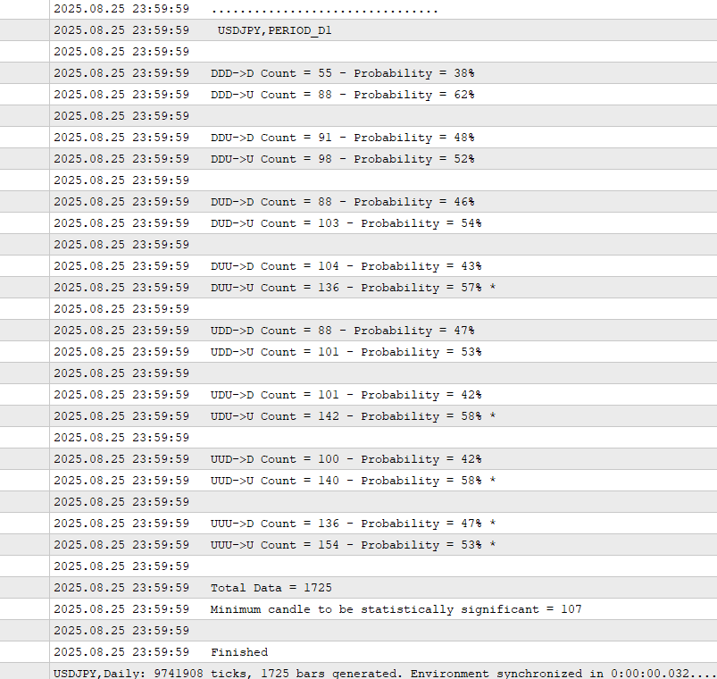
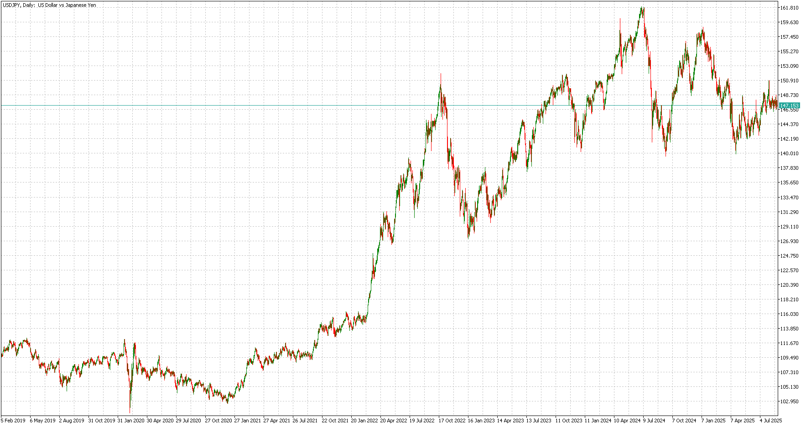

# Using Markov Chain to Analyze a Forex Pair
-- Part 2 --

Previous Section (part 1): [Basic Understanding of Markov Chain in Financial Market](https://github.com/handiko/Markov-Chain-In-Financial-Market/blob/main/README.md)

Based on the theoretical foundation from the previous section, we can now analyze a forex pair to gain an initial understanding of its behavior. The primary goal is to derive insights that can serve as the basis for developing a new trading strategy. This analytical approach provides a valuable first glimpse into the market's underlying dynamics.

## Previous Up/Down Day and Its Relation to the Next Day's State
This chapter aims to analyze the transition probabilities of daily market movements. Specifically, we will answer the question: What is the likelihood that an up or down day will be followed by another up or down day?

Using **U** to represent an up day and **D** to represent a down day, the full list of possible transitions is:

$U \to U$

$U \to D$

$D \to U$

$D \to D$

There are $N^{M}$ possible transitions for $N$-states that precede it and $M$-states that follow. Since $N = 2$, for either $U$ or $D$, and $M = 2$, for either $U$ or $D$ as well, 4 transitions could occur for a 1-previous up-or-down day related to the next day's state.


* $P_{U \to U}$: The probability of an Up day being followed by an Up day.
* $P_{U \to D}$: The probability of an Up day being followed by a Down day.
* $P_{D \to U}$: The probability of a Down day being followed by an Up day.
* $P_{D \to D}$: The probability of a Down day being followed by a Down day.

The transition matrix for this chain is:

$$
P = 
\begin{pmatrix}
p_{\text{UU}} & p_{\text{UD}} \\
p_{\text{DU}} & p_{\text{DD}} 
\end{pmatrix}
$$

Since the following day must be either an Up or a Down day, then the probabilities of transitioning from a specific state must sum to 1.

* $P_{U \to U} + P_{U \to D} = 1$
* $P_{D \to U} + P_{D \to D} = 1$

By getting the insight into these probabilities, we actually learn quite a bit about the specific market.

### MQL5 Code to Extract the Transition Probabilities
In the folder "Markov Chain Study", I included a simple MQL5 code "_Candle Pattern Study - 1 Candle.mq5_" to "extract" the transition matrix from a specific forex pair. The code can actually run on any market as long as it is listed on the MetaTrader platform.

The code snippet that actually runs the calculation:
```mql5
#define PREVIOUS_CANDLE 1
#define CANDLE (PREVIOUS_CANDLE+1)
#define COMBINATIONS 4

struct Pattern {
     int       count;
     double    probability;
};

struct Price {
     double    o;
     double    c;
};

Pattern pattern[COMBINATIONS];
Price price[CANDLE];

// ..........

void OnTick() {
     int bars = iBars(_Symbol, InpTimeframe);
     int patt = 0;
     if(bars != totalBars) {
          totalBars = bars;

          for(int i = 0; i < CANDLE; i++) {
               price[i].o = iOpen(_Symbol, InpTimeframe, CANDLE - i);
               price[i].c = iClose(_Symbol, InpTimeframe, CANDLE - i);

               patt += ((price[i].o < price[i].c) ? 1 : 0) << (CANDLE - 1 - i);
          }

          CountPattern(pattern[patt]);
     }
}
```
The code analyzes the two most recent candles—for example, today's and yesterday's on a daily timeframe to determine market direction. If a candle's open price is lower than its close, it's classified as a down day; otherwise, it's an up day. The code then evaluates these two-candle sequences, tallies each sequence's occurrence, and stores the data in the pattern struct variable. Once the entire price chart is processed, it calculates the transition probability for each sequence based on the predefined transition matrix.

By running the included MQL5 code on **USDJPY D1 from 2019-01-01**, we get the following results:



As a result, we get the transition probabilities:
* $P_{U \to U} = 0.55$
* $P_{U \to D} = 0.45$
* $P_{D \to U} = 0.57$
* $P_{D \to D} = 0.43$

And it fulfills the conditions:
* $P_{U \to U} + P_{U \to D} = 1$
* $P_{D \to U} + P_{D \to D} = 1$

---

## Higher Order Markov Chain
Higher-order Markov chain is a probabilistic model where the future state depends on a sequence of preceding states, not just the single most recent one. While a first-order Markov chain has a memory of only one step, a higher-order chain accounts for a longer memory. This capability allows it to capture more complex dependencies and intricate patterns within a sequence of price data.

### Understanding the States
In the previous example, each element is a sequence of trading days, each with one of two states: up (U) or down (D). A standard first-order Markov chain would model the probability of the next day's state (U or D) based exclusively on the current day's state. For example:

* $P_{U \to U}$: The probability of an Up day being followed by an Up day.
* $P_{U \to D}$: The probability of an Up day being followed by a Down day.
* $P_{D \to U}$: The probability of a Down day being followed by an Up day.
* $P_{D \to D}$: The probability of a Down day being followed by a Down day.

A second-order Markov chain, however, uses the two previous days to determine the probability of the next one. In this model, the states are no longer singular (U or D) but are instead pairs of consecutive states, such as UU, UD, DU, and DD.

### Transition Probabilities in a Higher-Order Chain
The core of a Markov chain is its transition probability matrix, which contains the probabilities of moving from one state to another. In this example, the transitions are based on the two-state history. The transition probabilities would look like this:

* $P_{UU \to U}$: The probability of two Up days being followed by an Up day.
* $P_{UU \to D}$: The probability of two Up days being followed by a Down day.
* $P_{UD \to U}$: The probability of an Up day and then a Down day, being followed by an Up day.
* $P_{UD \to D}$: The probability of an Up day and then a Down day being followed by a Down day.
* $P_{DU \to U}$: The probability of a Down day then an Up day, being followed by an Up day.
* $P_{DU \to D}$: The probability of a Down day then an Up day, being followed by a Down day.
* $P_{DD \to U}$: The probability of two Down days being followed by an Up day.
* $P_{DD \to D}$: The probability of two Down days being followed by a Down day.

The sum of probabilities for each history must equal 1. For example, $P_{UU \to U} + P_{UU \to D} = 1$

### MQL5 Code to Extract the Transition Probabilities from Higher Order Markov Chain
In the folder "Markov Chain Study", I included a simple MQL5 code "_Candle Pattern Study - 2 Candle.mq5_" to "extract" the transition matrix from a specific forex pair. The code can actually run on any market as long as it is listed on the MetaTrader platform.

The code snippet that runs the calculation is actually very similar to the previous one. It only needed to change the defines as follows:

```mql5
#define PREVIOUS_CANDLE 2
#define CANDLE (PREVIOUS_CANDLE+1)
#define COMBINATIONS 8
```

The rest of the code is very much the same. The result of the code being run on **USDJPY D1 from 2019-01-01**:



As a result, we get the transition probabilities:
* $P_{UU \to U} = 0.55$
* $P_{UU \to D} = 0.45$
* $P_{UD \to U} = 0.56$
* $P_{UD \to D} = 0.44$
* $P_{DU \to U} = 0.56$
* $P_{DU \to D} = 0.44$
* $P_{DD \to U} = 0.57$
* $P_{DD \to D} = 0.43$

Or in the form of a transition table:

|                     | Next day is U | Next day is D |
|---------------------|---------------|--------------|
| Previuos days is UU | 0.55          | 0.45         |
| Previuos days is UD | 0.56          | 0.44         |
| Previuos days is DU | 0.56          | 0.44         |
| Previuos days is DD | 0.57          | 0.43         |

And it fulfills the conditions:
* $P_{UU \to U} + P_{UU \to D} = 1$
* $P_{UD \to U} + P_{UD \to D} = 1$
* $P_{DU \to U} + P_{DU \to D} = 1$
* $P_{DD \to U} + P_{DD \to D} = 1$

### Last Example: 3-Previous Days Markov Chain
The transition probabilities would look like this:
* $P_{UUU \to U}$
* $P_{UUU \to D}$
* $P_{UUD \to U}$
* $P_{UUD \to D}$
* $P_{UDU \to U}$
* $P_{UDU \to D}$
* $P_{UDD \to U}$
* $P_{UDD \to D}$
* $P_{DUU \to U}$
* $P_{DUU \to D}$
* $P_{DUD \to U}$
* $P_{DUD \to D}$
* $P_{DDU \to U}$
* $P_{DDU \to D}$
* $P_{DDD \to U}$
* $P_{DDD \to D}$

The code snippet that runs the calculation is also very similar. It only needed to change the defines as follows:

```mql5
#define PREVIOUS_CANDLE 3
#define CANDLE (PREVIOUS_CANDLE+1)
#define COMBINATIONS 16
```

The rest of the code is very much the same. The result of the code being run on **USDJPY D1 from 2019-01-01**:



As a result, we get the transition table:

|                      | Next day is U | Next day is D |
|----------------------|---------------|--------------|
| Previuos days is UUU | 0.53          | 0.47         |
| Previuos days is UUD | 0.58          | 0.42         |
| Previuos days is UDU | 0.58          | 0.42         |
| Previous days is UDD | 0.53          | 0.47         |
| Previous days is DUU | 0.57          | 0.43         |
| Previous days is DUD | 0.54          | 0.46         |
| Previous days is DDU | 0.52          | 0.48         |
| Previous days is DDD | 0.62          | 0.38         |

### Interpreting The Results
1. Market Bias: The tables indicate a clear bullish bias for the USDJPY pair on the daily (D1) timeframe. The transition probabilities consistently favor the "Next day is U" (up) column. While this finding might be surprising to some, it aligns with the pair's overall upward trend observed from early 2020 to the present.
2. Predictive Power: A comparison of the 1, 2, and 3-day transition probabilities reveals an increase in predictive power as the number of preceding days considered in the analysis grows. The 1-day model, with its shorter memory, is more susceptible to market noise. In contrast, models that incorporate a longer sequence of prior states (e.g., 2 or 3 days) are better at capturing significant, underlying patterns, which leads to a more robust prediction for the following day. This demonstrates the value of using a higher-order Markov chain to filter out short-term fluctuations and focus on more reliable, long-term trends.

A bullish USDJPY chart from 2019-01-01


---

Codes related to this article:
* [Candle Pattern Study - 1 candle.mq5](https://github.com/handiko/Markov-Chain-UpDown-Day/blob/main/Markov%20Chain%20Study/Candle%20Pattern%20Study%20-%201%20candle.mq5)
* [Candle Pattern Study - 2 candle.mq5](https://github.com/handiko/Markov-Chain-UpDown-Day/blob/main/Markov%20Chain%20Study/Candle%20Pattern%20Study%20-%202%20Candle.mq5)
* [Candle Pattern Study - 3 candle.mq5](https://github.com/handiko/Markov-Chain-UpDown-Day/blob/main/Markov%20Chain%20Study/Candle%20Pattern%20Study%20-%203%20Candle.mq5)

---
Next section (part 3): [Using a Markov chain to determine market risk](https://github.com/handiko/Markov-Chain-In-Financial-Market-Risk/blob/main/README.md)

Next Section (part 4): [Trading Strategy Development Example](https://github.com/handiko/Trading-Strategy-Development-Example/blob/main/README.md)

Next Section (part 5): [Trading Strategy Improvement](https://github.com/handiko/Improvement-to-an-existing-strategy/blob/main/README.md)
